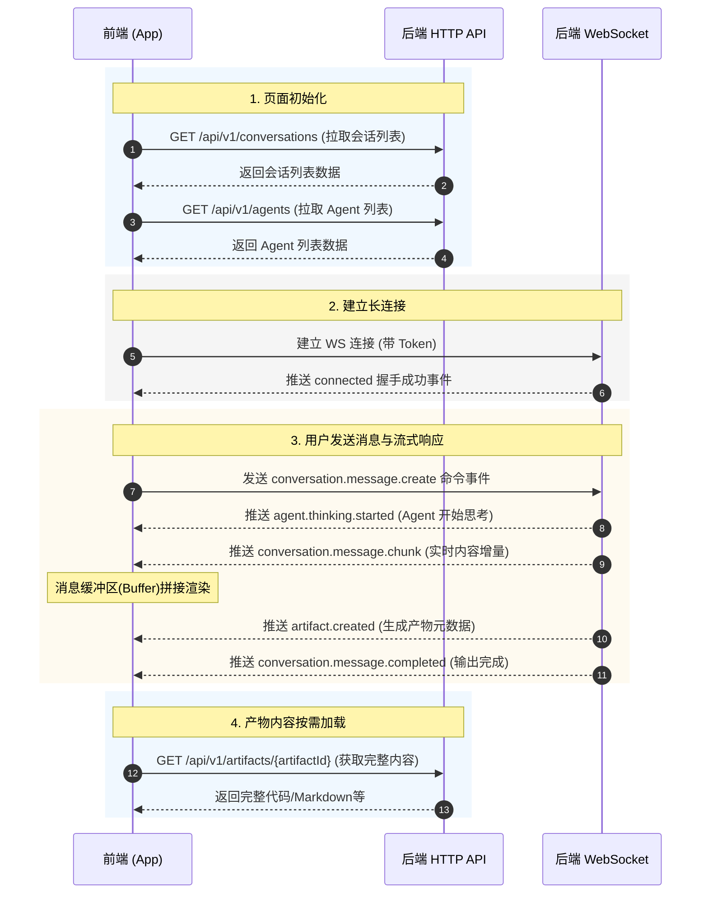
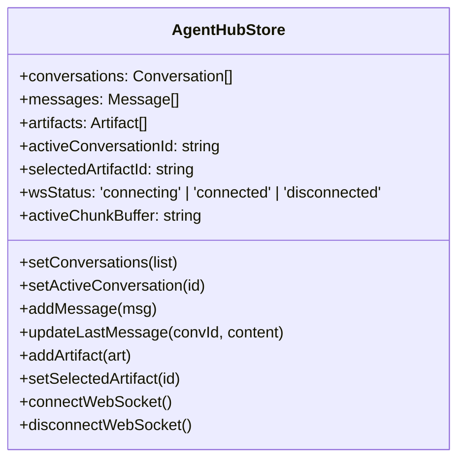

# AgentHub 前端设计文档（第二阶段）

## 1. 文档说明

### 1.1 文档目的

本文档用于指导 AgentHub 多 Agent 协作平台 Web 前端第二阶段的设计与开发。在第一阶段前端 MVP 静态 Mock 的基础之上，第二阶段将实现**真实后端接口对接**、**HTTP 与 WebSocket 混合通信架构集成**、**大模型流式输出（Streaming）渲染**、**Zustand 全局状态管理**以及**产物（Artifact）版本控制与代码 Diff 视图**。

本文档将作为开发人员、AI 协作编码、系统集成测试与项目最终验收的权威技术参考。

### 1.2 设计目标

第二阶段的架构与交互设计应达成以下核心目标：

1. **混合通信闭环**：通过 HTTP API 完成常规 CRUD 操作（如会话管理、Agent配置、产物元数据与完整内容拉取）；通过 WebSocket 接收实时的多 Agent 状态同步、思考过程及流式消息推送。
2. **流畅打字机效果**：通过高效的 Buffer 机制，解决 WebSocket 增量 Chunk 乱序与渲染高频重绘带来的卡顿问题，呈现顺畅的流式输出体验。
3. **统一状态管理**：引入 Zustand 集中管理应用生命周期内的连接状态、会话列表、实时消息缓冲区、当前 Agent 状态以及产物版本树。
4. **产物版本与 Diff 控制**：右侧产物面板支持版本切换、历史追溯，并支持直观的代码 Diff 视图展示 Agent 在上下文对话中对产物的修改。
5. **健壮的连接自愈**：实现带指数退避算法的自动重连机制，以及心跳（Ping/Pong）检测，确保 WebSocket 在网络波动下的稳定性。

---

## 2. 技术栈设计 (第二阶段)

### 2.1 核心技术栈

第二阶段继续沿用并升级原有的核心技术栈：

```text
React (v18+) + TypeScript + Vite + Tailwind CSS
```

### 2.2 新增关键依赖

为支持第二阶段的后端集成与高级交互，需安装以下第三方依赖包：

| 依赖包 | 推荐版本 | 用途说明 |
|---|---|---|
| **Zustand** | `^4.5.0` | 全局状态管理，解决多组件间频繁的状态共享与长连接数据分发问题 |
| **Axios** | `^1.6.0` | HTTP 客户端封装，支持拦截器自动注入 Authorization Token |
| **react-diff-viewer-continued** | `^3.3.0` | 高性能的 React 代码 Diff 视图组件，用于展示不同版本 Artifact 的差异 |
| **diff** | `^5.2.0` | JavaScript 文本差异计算库，为 Diff 视图提供数据比对支持 |

### 2.3 开发环境依赖预留

- **ESLint / Prettier**：统一代码格式，特别是在处理异步数据流与复杂渲染逻辑时，避免代码风格不一致引入的 Bug。
- **TypeScript 严格模式**：全量开启严格模式，规范 API 数据解析与 WebSocket 事件流的强类型约束。

---

## 3. 系统通信与数据同步流

第二阶段采用 **HTTP + WebSocket 混合架构** 以支持高效、低延迟的实时 Agent 交互。

### 3.1 混合架构通信模式

前端在与后端通信时，遵循“**CRUD 走 HTTP，流式/状态走 WebSocket，大文件拉取走 HTTP**”的职责分工：



### 3.2 建立与管理 WebSocket 连接

WebSocket 连接生命周期在 `wsClient.ts` 中集中管理，核心逻辑设计如下：

#### 3.2.1 握手与鉴权
建立连接时将 JWT Token 拼接在 URL 查询参数中：
```text
ws://localhost:8000/ws?token=${localStorage.getItem('auth_token')}
```

#### 3.2.2 心跳包机制（Heartbeat）
- **触发源**：前端定时器。
- **策略**：每 25 秒向服务端发送一次 `{"type": "ping"}`。
- **超时判定**：若发送 ping 后 10 秒内未收到服务端的 `pong` 响应，主动断开当前连接，触发重连机制。

#### 3.2.3 自动重连机制
- **退避算法**：采用**指数退避算法**，防止瞬间对后端造成高并发冲击。
- **重连公式**：$Delay = \min(1000 \times 2^{attempts}, 30000)$ 毫秒（每次尝试间隔翻倍，最大 30 秒）。
- **重试上限**：最多连续重试 5 次，超出后在 UI 上展示“连接断开，请检查网络后手动重试”的警告横幅。

### 3.3 消息流式输出处理设计

为了防止 WebSocket 频繁推送 Chunk 导致 React 组件极高频地重绘（Re-render），前端引入 **缓冲机制（Chunk Buffer）** 与 **分批渲染渲染控制**。

#### 3.3.1 Chunk 乱序与丢包校验
每一个 `conversation.message.chunk` 事件都包含一个唯一的 `sequence` 序号。
1. 前端在接收到 Chunk 后，根据 `sequence` 进行校验。
2. 若检测到 `sequence` 缺失（例如收到 3 之后收到了 5），说明发生了网络丢包，前端立即调用 HTTP 接口 `GET /api/v1/conversations/{conversationId}/messages` 同步最新的完整消息历史以修正状态。

#### 3.3.2 渲染缓冲策略
1. **缓冲数组**：Zustand Store 中为当前处于“输出中”的消息维护一个 `activeChunkBuffer` 字符串。
2. **频率控制**：采用 `requestAnimationFrame`（或限制 50ms 更新频率）将 Buffer 中的数据同步写入页面 State，避免每次收到微小 Chunk 都执行 DOM 刷新。
3. **结束同步**：收到 `conversation.message.completed` 事件时，直接用服务端返回的 `fullMessage` 覆盖本地拼接的临时消息，完成状态闭环。

---

## 4. 状态管理设计 (Zustand)

第二阶段将复杂的 UI 状态与网络数据流剥离，全部收敛至 Zustand 的 `useAgentHubStore` 中。

### 4.1 全局 Store 结构



### 4.2 State 与 Actions 详细定义

#### 4.2.1 State 定义
```typescript
interface AgentHubState {
  // 通讯与连接状态
  wsStatus: 'connecting' | 'connected' | 'disconnected';
  reconnectCount: number;

  // 数据实体
  conversations: Conversation[];
  messages: Message[]; // 当前活跃会话的消息历史
  artifacts: Artifact[]; // 当前活跃会话的产物列表
  agents: Agent[]; // 系统内所有 Agent 的信息

  // 当前选中状态
  activeConversationId: string | null;
  selectedArtifactId: string | null;
  selectedArtifactVersion: number | null; // 产物当前选中版本号，默认最新
  
  // 流式输出临时缓冲区
  streamingMessageId: string | null;
  streamingContent: string;
}
```

#### 4.2.2 Actions 接口设计
```typescript
interface AgentHubActions {
  // 初始化与全局数据加载
  initStore: () => Promise<void>;
  fetchConversations: () => Promise<void>;
  fetchAgents: () => Promise<void>;
  
  // 会话控制
  setActiveConversationId: (id: string) => Promise<void>;
  createConversation: (title: string, mode: 'single' | 'group', agentIds: string[]) => Promise<void>;
  deleteConversation: (id: string) => Promise<void>;

  // 消息控制
  sendMessage: (content: string) => void;
  appendUserMessage: (msg: Message) => void;
  
  // 产物控制
  setSelectedArtifactId: (id: string | null) => void;
  setSelectedArtifactVersion: (version: number) => void;
  loadArtifactContent: (id: string) => Promise<void>;

  // WebSocket 动作
  connectWS: () => void;
  disconnectWS: () => void;
  handleWSEvent: (event: any) => void;
}
```

---

## 5. 项目目录结构 (第二阶段)

第二阶段对 `src/` 结构进行了规范化调整，重点新增并充实了 `services/` 服务层，为对接真实后端做好解耦准备。

```text
src/
├── assets/
│
├── components/
│   ├── layout/
│   │   ├── AppLayout.tsx           # 三栏式整体框架布局
│   │   ├── Sidebar.tsx             # 左侧导航栏（含会话列表与搜索）
│   │   ├── ChatPanel.tsx           # 中间对话窗口主面板
│   │   └── RightPanel.tsx          # 右侧详情辅助面板（Agent & Artifacts）
│   │
│   ├── chat/
│   │   ├── MessageList.tsx         # 消息流列表容器
│   │   ├── MessageBubble.tsx       # 单个消息气泡（分派不同的渲染组件）
│   │   ├── ChatInput.tsx           # 支持 Enter 发送与换行的输入框
│   │   ├── CodeBlock.tsx           # 优化后的语法高亮及代码复制组件
│   │   ├── TaskPlanCard.tsx        # Orchestrator 任务拆解与分发进度卡片
│   │   └── ArtifactMessage.tsx     # 消息流内部内联的产物卡片
│   │
│   ├── agent/
│   │   ├── AgentList.tsx           # 当前会话参与 Agent 列表
│   │   └── AgentCard.tsx           # 带状态指示灯（Thinking/Online）的 Agent 卡片
│   │
│   ├── artifact/
│   │   ├── ArtifactList.tsx        # 当前会话生成的所有产物列表
│   │   ├── ArtifactCard.tsx        # 单个产物卡片项
│   │   ├── ArtifactPreview.tsx     # 产物预览核心，含代码/文档渲染与版本对比
│   │   └── CodeDiffViewer.tsx      # 代码 Diff 差异对比组件
│   │
│   └── modal/
│       └── NewConversationModal.tsx # 新建会话弹窗
│
├── services/                       # 核心服务层
│   ├── index.ts                    # Axios 拦截器与基础配置
│   ├── http/
│   │   ├── agentService.ts         # Agent 相关 HTTP API 请求
│   │   ├── conversationService.ts  # 会话管理 HTTP API 请求
│   │   ├── messageService.ts       # 消息历史分页拉取 API
│   │   └── artifactService.ts      # 产物完整详情拉取 API
│   └── ws/
│       ├── wsClient.ts             # WebSocket 客户端连接管理与心跳实现
│       └── wsTypes.ts              # WebSocket 所有 Event 的 TS 类型定义
│
├── store/                          # 状态管理目录
│   └── useAgentHubStore.ts         # Zustand 全局 Store 实现
│
├── types/                          # 类型定义目录
│   └── index.ts                    # 数据模型与通用 TS Interface 声明
│
├── utils/                          # 辅助工具函数
│   ├── time.ts                     # 时间格式化工具
│   └── id.ts                       # 本地唯一 ID 生成工具
│
├── App.tsx                         # 根组件，全局 Store 初始化与连接引导
├── main.tsx                        # 应用入口
└── index.css                       # 全局样式，包含 Tailwind 及自定义过渡动画
```

---

## 6. 核心功能模块详细设计

### 6.1 会话管理

会话管理在第二阶段从 Mock 改为使用常规 HTTP 请求，支持以下行为：

1. **会话列表展示**：
   - **请求**：`GET /conversations?page=1&pageSize=50`
   - **逻辑**：页面初始化或切换会话时，拉取会话信息，填充至 Zustand。
2. **会话切换数据联动**：
   - 当用户点击切换会话时，清空当前聊天区的 `messages` 与 `artifacts` 列表。
   - 分别发起并发请求：`GET /conversations/{id}/messages` 拉取历史消息，并 `GET /conversations/{id}/artifacts` 拉取产物元数据。
   - 切换成功后，重置 `selectedArtifactId` 为当前会话的第一个产物。

### 6.2 实时聊天与流式渲染

流式消息的渲染是第二阶段的核心交互难点，设计如下：

1. **输入与命令发送**：
   - 用户点击发送，触发 `ChatInput` 校验。
   - 清空输入框，通过 `wsClient.send('conversation.message.create', { conversationId, content })` 发送 WebSocket 事件，避免先调用 HTTP 增加延迟。
   - 前端本地即时生成一条 `role: 'user'` 消息加入消息流，并在输入框上方置为“正在等待响应”状态。
2. **打字机动态排版**：
   - 收到 `conversation.message.chunk` 后，前端在 Zustand Store 中更新对应的 `streamingContent`。
   - `MessageList` 监听该状态，如果是流式输出的消息，动态将其渲染出来。
   - 消息流容器需要计算 `scrollTop`，若用户当前处于消息最底部（即没有向上滚动查看历史），每次 Chunk 写入后**自动平滑滚动到底部**；若用户向上滚动了，则保持当前视角，并在右下角提供“有新消息，点击滚动至底部”的浮动悬浮按钮。
3. **Orchestrator 任务卡片设计**：
   - 当收到 Orchestrator 类型的系统消息时，解析其 `task-plan` 类型。
   - 任务卡片呈现为带有复选框或状态圈的节点树（如：Design -> Code -> Review -> Doc）。
   - 服务端通过 WebSocket 实时更新每个子 Agent 任务的运行状态（Waiting, Thinking, Done），卡片内的节点也做相应的高亮或勾选状态流转。

### 6.3 Agent 状态面板

右侧详情面板顶部为 Agent 列表，实时呈现当前协作会话中的 Agent 状态。

1. **信息展示**：
   - 渲染 Agent 头像、名称、职责描述和支持的工具集（如：Monaco, FileSystem）。
2. **状态灯实时同步**：
   - 监听 WebSocket 的 `agent.status.changed` 事件。
   - 接收到状态变化时，动态改变 Agent 卡片上的指示灯颜色：
     - `online` / `done`：绿色常亮。
     - `thinking`：蓝色呼吸灯闪烁。
     - `offline`：灰色。

### 6.5 产物（Artifact）管理与版本控制

真实产物的特点是存在迭代性（例如在同一会话中多次修改 App.tsx）。为了避免产物列表无限拉长，第二阶段引入**产物版本控制**。

1. **数据归集**：
   - 产物列表不以 `artifactId` 做直接展示，而是以**产物文件名/标题**（例如 `App.tsx`）聚合。
   - 数据结构在拉取后，前端以字典形式进行组织，按标题将同一产物的不同版本挂载在版本树下。
2. **版本切换下拉菜单**：
   - 在 `ArtifactPreview` 顶部，提供一个类似 Git 分支/Tag 风格的版本选择 Dropdown（显示如：`v3 (最新)`, `v2`, `v1`）。
   - 切换下拉菜单选项时，更新 Store 中的 `selectedArtifactVersion` 状态。
3. **内容懒加载**：
   - 产物列表或消息卡片中只承载产物元数据（如大小、创建时间、版本号）。
   - 只有当用户点击选择该版本时，前端才通过 HTTP 发起请求：`GET /artifacts/{artifactId}` 拉取大文件内容并缓存，防止初始化时网络负荷过大。

### 6.6 代码 Diff 视图

代码 Diff 视图让用户能够直观看到当前选中的产物版本与上一个版本之间的代码变化。

1. **UI 入口**：
   - 在 `ArtifactPreview` 顶部控制栏，提供一个“**对比**”或“**Diff 视图**”切换按钮。
2. **Diff 计算与渲染**：
   - 启用 `react-diff-viewer-continued` 组件。
   - **比对基准**：
     - 若当前选择版本为 `vX`，则将 `vX` 的内容作为 `newValue`。
     - 获取 `v(X-1)` 的内容作为 `oldValue`（若为 `v1` 则上个版本内容为空）。
   - **视图模式**：支持 Split（左右对照）和 Unified（上下整合）两种展现模式，提供切换按钮，并采用高保真的高亮色彩（红色代表删除，绿色代表新增）。

---

## 7. 接口映射与数据流交互规范

前端将服务端通过 WebSocket 推送的 Event 路由至具体的处理函数，事件类型与 Store 更新的映射规范如下：

| 接收 Event 类型 | 触发行为与 Store 更新逻辑 |
|---|---|
| **`connected`** | 将 `wsStatus` 设为 `'connected'`，重置重连计数器 `reconnectCount = 0`，向服务器发送当前活跃会话以保持状态对齐。 |
| **`agent.thinking.started`** | 1. 改变右侧 Agent 列表中该 Agent 的状态指示灯为 `'thinking'`。<br>2. 在聊天区插入一条处于 Loading 状态的消息骨架屏。 |
| **`conversation.message.chunk`** | 将增量 Chunk 追加到 `streamingContent` 中，并通知消息组件执行流式打字渲染。 |
| **`conversation.message.completed`** | 1. 将完整的 `fullMessage` 存入 `messages` 数组，清空临时缓冲区 `streamingContent = ""`。<br>2. 恢复该 Agent 的状态为 `'online'`。 |
| **`artifact.created`** | 1. 将新产物的元数据追加到 `artifacts` 数组中，并在消息流中呈现 ArtifactMessage 卡片。<br>2. 自动标记该产物为最新版本，并在右侧产物列表中点亮该项。 |
| **`conversation.all_tasks.completed`**| 在聊天流末尾渲染系统级别的“所有协作任务已完成”卡片，停止所有 Agent 状态灯的思考效果。 |

---

## 8. 开发与迭代建议

### 8.1 第二阶段开发顺序

推荐按照以下里程碑节点逐步演进：

1. **Milestone 1：服务层与长连接 (HTTP + WS 骨架)**
   - 封装 Axios，编写各模块 HTTP Service。
   - 实现 `wsClient.ts` 的核心连接逻辑、Ping/Pong 心跳以及退避重连算法。
2. **Milestone 2：全局 Store 构建 (Zustand 集成)**
   - 创建 `useAgentHubStore.ts`。
   - 将原有组件的 `useState` 数据流迁移至 Store 中，用 Store Actions 代替临时修改。
3. **Milestone 3：流式渲染与自动平滑滚动**
   - 联调 WebSocket Chunk 接收，实现中间聊天区打字机效果。
   - 完善消息列表自适应滚动到底部的定位机制。
4. **Milestone 4：产物版本管理与 Diff 视图**
   - 完成右侧详情面板产物元数据的版本归集。
   - 引入 `react-diff-viewer-continued` 并与版本下拉列表进行数据联动，支持左右分栏 Diff 展示。
5. **Milestone 5：容灾与边缘优化**
   - 补充各种网络异常横幅提示、加载骨架屏以及 API 错误状态码捕获。

### 8.2 与 AI 协作规范

与 AI 协作生成本阶段代码时，需严格执行以下 Prompt 控制原则：

- **明确告知状态流向**：凡是涉及数据读取或更新的行为，必须明确约束 AI 使用 Zustand Store 的 `useAgentHubStore.ts` 内定义的 Actions，严禁在页面组件中私自绕过 Store 进行全局状态修改。
- **保护长连接实例**：WebSocket 属于全局单例服务，在让 AI 修改网络模块时，必须明确指出维持 `wsClient.ts` 的单例模式，避免组件因生命周期销毁与重建导致重复连接或连接泄露。
- **Diff 组件轻量化**：对于大文件，Diff 计算较消耗计算性能。要求 AI 在计算 Diff 时利用 `useMemo` 对比对文本进行缓存，避免每次父组件重绘都重新执行昂贵的 Diff 计算。

---

## 9. 总结

AgentHub 第二阶段前端设计通过引入 **HTTP + WebSocket 混合架构** 与 **Zustand 全局状态调度**，将原本静态的 Mock 前端升级为生产级的实时协作 Web 工作台。

其设计核心在于：
- **高效的流式内容传输与打字机防抖控制**，以应对大模型高频输出带来的渲染压力。
- **清晰的版本管理和直观的代码 Diff 显示**，完美凸显了多 Agent 针对同一项目进行深度协作、代码持续迭代的产品特征。
- **高健壮性的连接自愈设计**，为课程答辩演示与多网络环境下的稳定性提供了坚实的技术保障。
